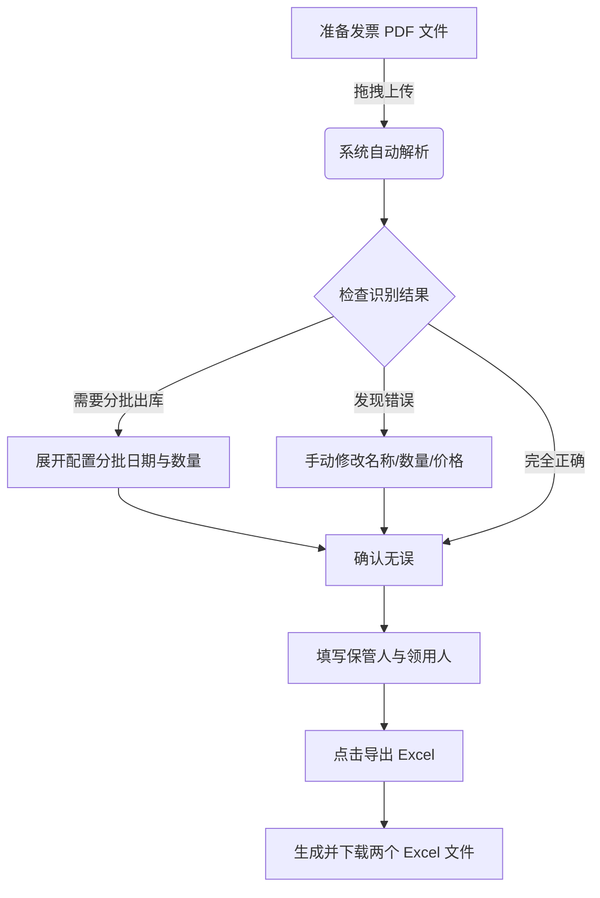

# 发票处理系统使用说明

本系统用于自动提取 PDF 电子发票信息，并生成实验室所需的《验收单》与《入库出库单》。

## ⚡️ 快速流程图

## 🛠 详细操作步骤

### 第一步：上传发票
打开网站，将您的 **PDF 电子发票**（支持批量）直接拖入页面上方的虚线框内。
> **提示**：如果是微信/支付宝开具的原生电子发票，识别准确率接近 100%。

### 第二步：核对与调整
系统解析后会列出所有条目。即便我们采用了最新的智能识别算法，建议您仍需简单核对：
1.  **基本信息**：检查“材料名称”、“规格型号”、“单价”、“数量”是否与发票一致。
2.  **查看原件**：如果对某个数据不确定，点击条目里的 **`view pdf`** 蓝色链接，可以立即查看原始发票。

### 第三步：配置出库（重点）
如果您购买的试剂或耗材需要**分多次使用**（例如买了5瓶酒精，分3次领用）：
1.  点击条目右侧的 **展开按钮**（向下箭头）。
2.  在“出库计划”区域，点击 **`+ 添加批次`**。
3.  设置每一次的 **出库日期** 和 **领用数量**。
    *   *系统会自动计算结余，确保总数对得上。*

### 第四步：导出表格
1.  在页面底部的“导出设置”中，填写 **保管人** 和 **领用人签字** 的名字。
2.  点击绿色的 **`导出 Excel 文件`** 按钮。
3.  系统会自动下载两个文件：
    *   `附件1：大连理工大学科研材料验收单.xlsx`
    *   `附件2：材料使用入库出库单.xlsx`

## 常见问题 (Q&A)

*   **Q: 为什么有的字识别错了？**
    *   A: 极少数发票排版特殊可能导致识别偏差，您可以直接在网页输入框里手动修改，改完再导出即可。
    
*   **Q: 导出的 Excel 格式乱吗？**
    *   A: 不会。系统会自动合并单元格，并计算好所有的金额和结余，直接打印即可。
